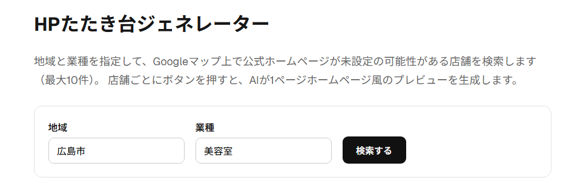
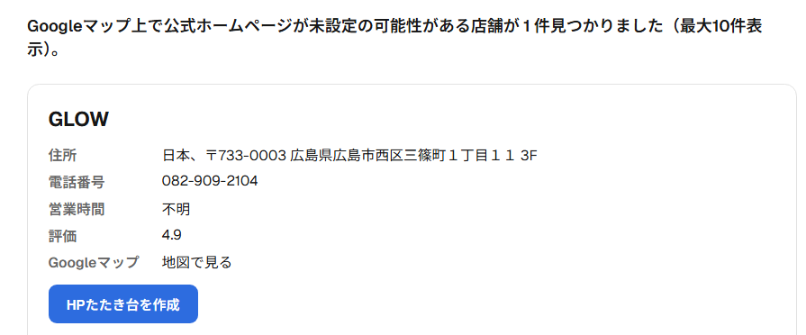
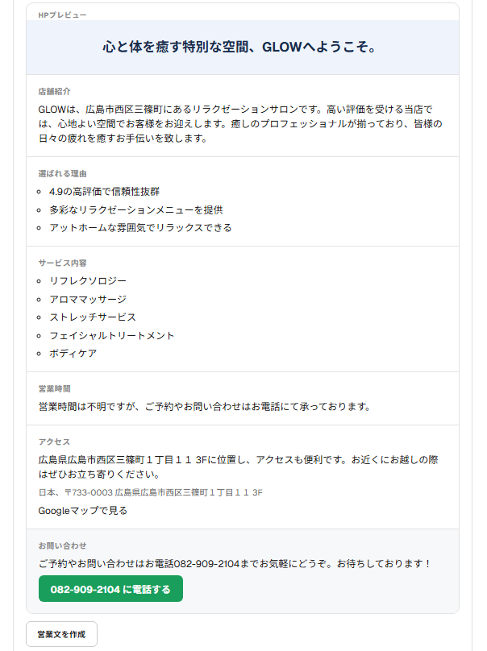
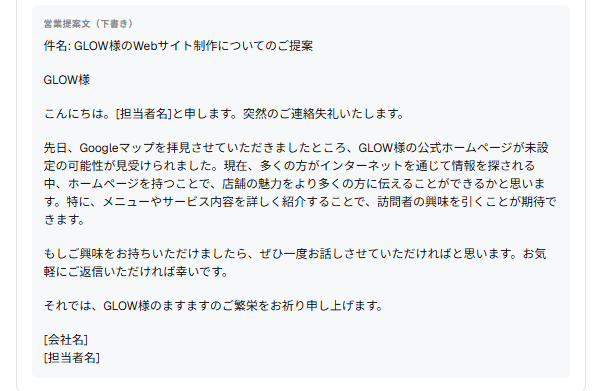

# AIホームページたたき台ジェネレーター

> 本アプリはGoogle Places API・OpenAI APIの利用料金が発生するため、公開デモURLは提供していません。動作イメージは下記「スクリーンショット」をご覧ください。実際に動かす場合はローカルで環境変数を設定して実行してください（下記「セットアップ方法」参照）。

## 概要

Google Places APIから店舗情報を取得し、
Googleマップ上で公式ホームページが未設定の可能性がある店舗を検索します。

検索した店舗情報をもとにOpenAI APIがホームページのたたき台を生成し、
ホームページ風プレビューを表示できるWebアプリです。

## 主な機能

・地域・業種から店舗検索
・Google Places API連携
・ホームページ未設定の可能性がある店舗を抽出（最大10件表示）
・店舗情報表示（店舗名・住所・電話番号・営業時間・評価）
・Googleマップリンク表示
・AIによるホームページたたき台生成（キャッチコピー〜お問い合わせまで7セクション）
・ホームページ風プレビュー表示（お問い合わせの電話番号はタップして発信可能）
・AIによる営業提案文の下書き生成
・生成したHPプレビューを単体のHTMLファイルとしてダウンロード
・店舗名とGoogleマップURLをGoogleスプレッドシートに保存（検索の地域×業種ごとにシートタブを自動作成）
・検索履歴・生成履歴の表示（ブラウザのlocalStorageに保存）
・レスポンシブ対応

## 使用技術

- Next.js（App Router）
- React
- TypeScript
- CSS Modules
- Google Places API（Text Search / Place Details）
- OpenAI API（Chat Completions）
- Google Sheets API（店舗名・URLの保存）

## ディレクトリ構成

```
hp-tataki-generator/
├── .env.local.example        # 環境変数のテンプレート
├── package.json
├── public/                   # 静的ファイル置き場（現在は未使用）
├── src/
│   ├── types.ts              # 共通の型定義（ShopSummary, GeneratedSite）
│   ├── app/
│   │   ├── layout.tsx         # 共通レイアウト・メタデータ
│   │   ├── page.tsx           # トップページ（検索フォーム・結果表示・プレビュー）
│   │   ├── page.module.css    # トップページのスタイル
│   │   ├── globals.css        # 全体共通スタイル
│   │   └── api/
│   │       ├── search/route.ts        # 店舗検索API（Google Places連携）
│   │       ├── generate/route.ts      # HPたたき台生成API（OpenAI連携）
│   │       ├── sales-pitch/route.ts   # 営業提案文生成API（OpenAI連携）
│   │       └── save-to-sheet/route.ts # 店舗名・URLのスプレッドシート保存API
│   └── lib/
│       ├── googlePlaces.ts    # Google Places APIの呼び出し処理
│       ├── openaiClient.ts    # OpenAI APIの呼び出し処理・プロンプト
│       ├── googleSheets.ts    # Google Sheets APIへの書き込み処理
│       ├── officialWebsite.ts # 公式サイトか予約サイト・SNS等かの判定
│       ├── history.ts         # 検索履歴・生成履歴のlocalStorage管理
│       ├── exportHtml.ts      # HPプレビューの単体HTMLファイル生成
│       ├── errorUtils.ts      # ネットワークエラーの原因推測メッセージ生成
│       └── textUtils.ts       # AI出力の箇条書きテキスト整形
└── tsconfig.json
```

## セットアップ方法

1. 依存パッケージをインストール

   ```
   npm install
   ```

2. `.env.local.example` をコピーして `.env.local` を作成

   ```
   cp .env.local.example .env.local
   ```

   （Windows PowerShellの場合は `Copy-Item .env.local.example .env.local`）

3. `.env.local` にAPIキーを設定（下記「環境変数」参照）

4. 開発サーバーを起動

   ```
   npm run dev
   ```

   `http://localhost:3000`（使用中の場合は3001など）にアクセス

## 環境変数

`.env.local` に以下を設定してください。

```
GOOGLE_PLACES_API_KEY=
OPENAI_API_KEY=
OPENAI_MODEL=gpt-4o-mini
GOOGLE_SHEETS_SPREADSHEET_ID=
GOOGLE_SHEETS_CREDENTIALS_FILE=google-sheets-credentials.json
```

- `GOOGLE_PLACES_API_KEY`: Google CloudでPlaces APIを有効化して取得したキー
- `OPENAI_API_KEY`: OpenAI Platformで取得したシークレットキー
- `OPENAI_MODEL`: 使用するモデル（省略時は `gpt-4o-mini`）
- `GOOGLE_SHEETS_SPREADSHEET_ID`: 保存先スプレッドシートのID（URLの `/d/` と `/edit` の間の文字列）
- `GOOGLE_SHEETS_CREDENTIALS_FILE`: サービスアカウントのJSONキーファイルのパス（ローカル実行用。プロジェクト直下からの相対パス）
- `GOOGLE_SHEETS_SERVICE_ACCOUNT_JSON`: サービスアカウントのJSONキーの中身をそのまま貼り付けたもの（Vercelなどファイルを配置できない環境用。設定されている場合はこちらが優先されます）

### スプレッドシート連携の準備

**ローカル実行の場合**

1. Google Cloudでサービスアカウントを作成し、JSONキーファイルをダウンロード
2. Google Sheets APIを有効化
3. ダウンロードしたJSONファイルを `hp-tataki-generator` フォルダ直下に置く（例: `google-sheets-credentials.json`。このファイルは `.gitignore` 済みでGitには含まれません）
4. 保存先にしたいスプレッドシートを開き、「共有」からJSONファイル内の `client_email`（`xxx@xxx.iam.gserviceaccount.com` の形式）を編集者として追加
5. `.env.local` の `GOOGLE_SHEETS_SPREADSHEET_ID` と `GOOGLE_SHEETS_CREDENTIALS_FILE`（配置したファイル名）を設定

`private_key` や改行の扱いを手動でコピペする必要はなく、JSONファイルを置くだけで動作します。

**Vercelにデプロイする場合**

ファイルをサーバーにアップロードできないため、代わりにJSONキーの中身をそのまま環境変数に設定します。

1. 上記1〜4と同様にサービスアカウントを準備し、スプレッドシートを共有
2. ダウンロードしたJSONファイルをテキストエディタで開き、中身をすべてコピー
3. Vercelの `Settings` → `Environment Variables` で `GOOGLE_SHEETS_SERVICE_ACCOUNT_JSON` にコピーした内容をそのまま貼り付け（改行を含んでいても問題ありません）
4. `GOOGLE_SHEETS_SPREADSHEET_ID` も同様に設定し、再デプロイ

「スプレッドシートに保存」ボタンを押すと、検索した地域×業種ごとにシートタブが自動作成され、店舗名・GoogleマップURL・地域・業種・保存日時が1行追加されます。

## 今後追加予定

・画像生成AI連携
・営業メール自動生成
・LINE営業文生成
・ワンクリックデプロイ
・ホームページZIPダウンロード

## スクリーンショット

**検索フォーム**



**検索結果（店舗情報）**



**HPたたき台プレビュー**



**営業提案文（下書き）**



## 注意事項・既知の制限

- Google Places API の Text Search は1回の検索につき最大20件まで取得しますが、画面には最大10件のみ表示します（ページングは未実装です）。
- 生成されるのは「文章・レイアウトのたたき台」のみです。実際に公開できるWebページ（本番用のHTML/デザイン）としての出力は含まれていません。
- 「公式ホームページが未設定の可能性がある」の判定は、Google Places APIの`website`欄が「空欄」または「ホットペッパー・食べログ・Instagram等の既知の予約サイト/SNSドメイン」の場合に該当するとみなしています（`src/lib/officialWebsite.ts`の一覧で判定）。この一覧にない独自ドメインの簡易サイト（ペライチ等）は「公式サイトあり」として除外されます。アプリ内では常に「ホームページがない」と断定せず、「未設定の**可能性がある**」という表現にとどめています。実際には別ドメインで運用している場合もあるため、営業・提案の際は事前確認をおすすめします。
- APIの呼び出しには料金が発生する場合があります（Google Places API・OpenAI APIともに従量課金）。テスト時は検索回数・生成回数に注意してください。
- 生成される文章はAIによる推測を含みます。実際に営業・提案で利用する前に、内容の事実確認（住所・電話番号・営業時間など）を必ず行ってください。
- 検索履歴・生成履歴はブラウザのlocalStorageに保存されます。別のブラウザ・端末とは共有されず、ブラウザのデータを消去すると履歴も消えます。
- スプレッドシートへの保存はボタンを押したときのみ実行されます（自動保存ではありません）。
